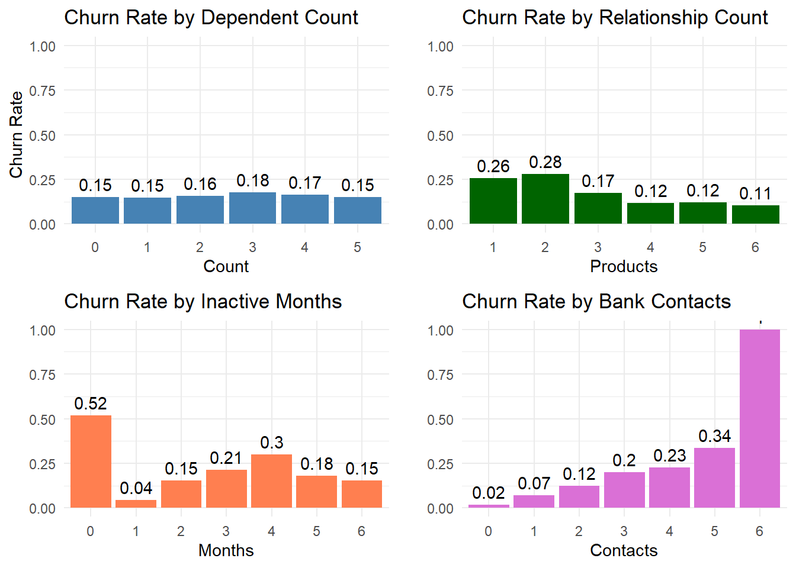
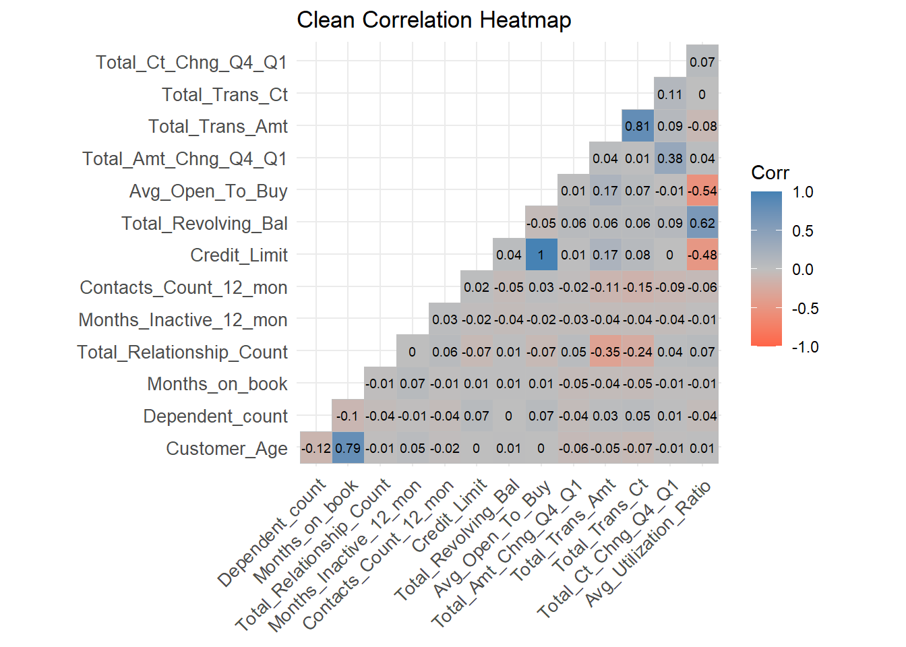
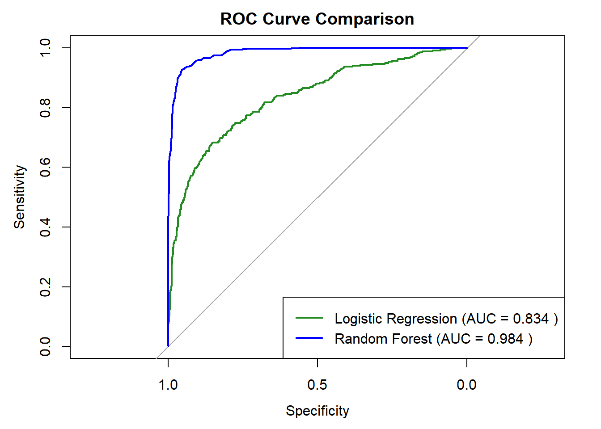
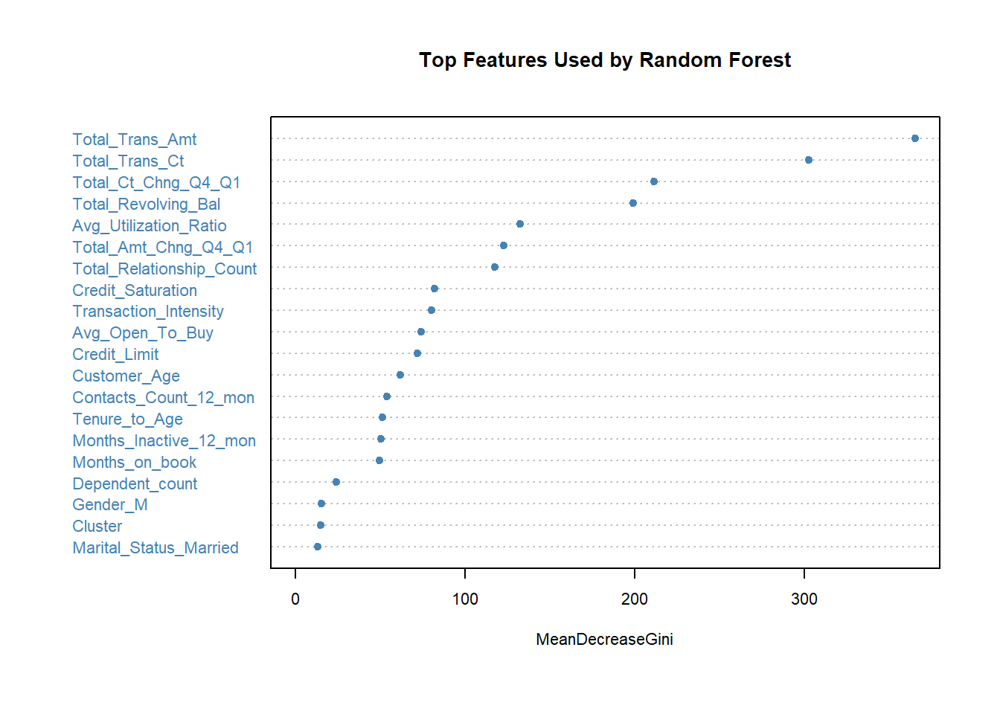
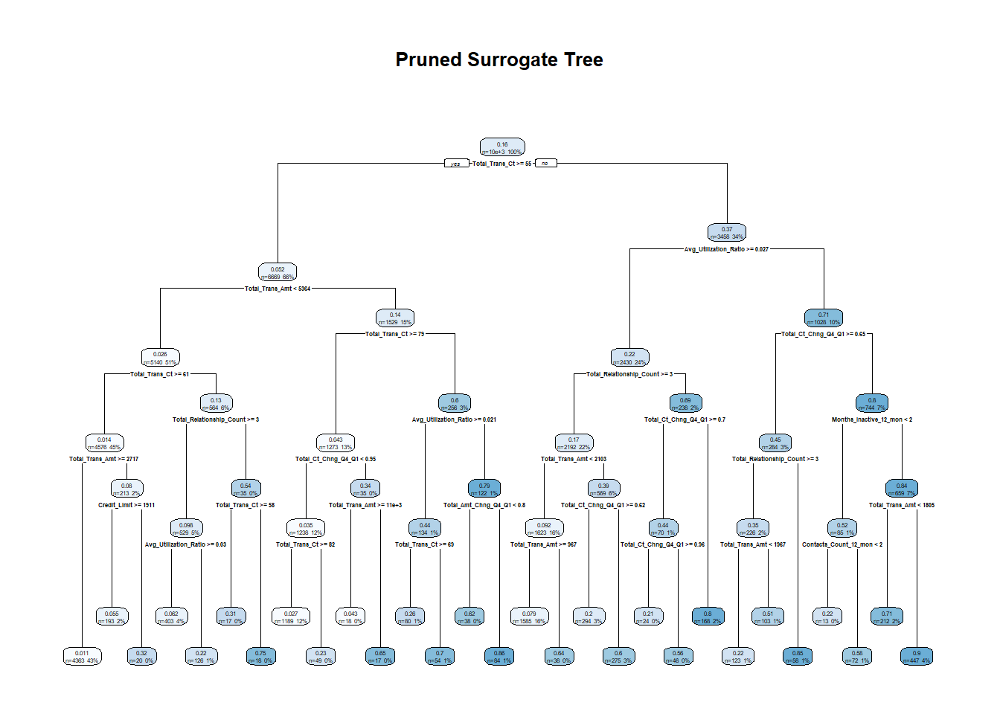

# Bank Customer Churn Prediction

A machine learning study that predicts retail-banking customer churn from demographic, account and transactional data, and translates the model's output into actionable, risk-segmented retention strategies.

> **Research question:** *To what extent can machine learning models predict customer churn using historical data in a retail banking context?*

---

## Overview

Retaining an existing customer can cost 5–25× less than acquiring a new one, and reducing churn by just 5% can raise profits substantially. Yet churn management in many banks remains reactive. This project builds a **predictive churn model** that enables *proactive* intervention, framing the task as a **binary classification** problem (`1 = churned`, `0 = retained`).

Beyond raw prediction, the analysis interprets the model with a **surrogate decision tree** and segments customers into **High / Medium / Low** churn-risk groups, each mapped to a concrete CRM action plan.

## Dataset

- **Source:** [BankChurners (Kaggle)](https://www.kaggle.com/code/nnttch/bankchurners-eda-smote-statsmodels)
- **Records:** 10,127 customers · **Variables:** 23
- **Target:** `Attrition_Flag` (transformed to binary `1 = churned`, `0 = retained`)
- **Feature groups:** demographics (age, gender, dependents, education, marital status, income), account characteristics (tenure, card category, products held, credit limit), and transactional behaviour (transaction count/amount, utilization ratio, activity changes).
- **Key challenges:** class imbalance (churn is the minority class), correlated features, and `Unknown` categories.

> The two pre-computed `Naive_Bayes_Classifier` columns and the `CLIENTNUM` identifier are dropped, as they carry leakage/no predictive value.

## Methodology

The full workflow lives in [`Analysis.Rmd`](Analysis.Rmd):

1. **Data Preparation** — loading, cleaning, target encoding, and per-variable assessment.
2. **Exploratory Data Analysis** — univariate distributions, churn rate by category, numeric comparisons, and a correlation analysis of numeric features.
3. **Feature Engineering & Dimensionality Reduction** — new derived features, **K-Means clustering** (k = 3), and **PCA**.
4. **Modeling** — **Logistic Regression** (on PCA components) vs. **Random Forest** (all features), evaluated with a train/test split.
5. **Tuning** — Random Forest hyperparameter tuning via `caret`, and L1-regularized Logistic Regression via `glmnet`.
6. **Interpretation** — feature importance, a **surrogate regression tree** to explain the Random Forest, and validation of the surrogate against the model.
7. **Business Translation** — churn-risk segmentation with tailored retention recommendations.

### Exploratory highlights

Churn rises sharply with the number of bank contacts and is highest among customers holding few products, while a low correlation between most behavioural features keeps multicollinearity in check.

| Churn rate by category | Correlation of numeric features |
|:---:|:---:|
|  |  |

## Results

Performance on the held-out test set:

| Metric            | Logistic Regression (PCA) | Random Forest |
|-------------------|---------------------------|---------------|
| Accuracy          | 87.65%                    | **94.91%**    |
| Sensitivity       | 36.79%                    | **75.16%**    |
| Specificity       | 97.13%                    | **98.59%**    |
| Balanced Accuracy | 66.96%                    | **86.88%**    |
| Kappa             | 0.42                      | **0.79**      |

**Random Forest is the preferred model**: it identifies churners far more reliably (higher sensitivity) while keeping false positives low. Logistic Regression remains a useful interpretability benchmark but its low recall limits standalone use. The ROC curves confirm this gap in discriminative power (AUC 0.984 vs. 0.834).



### What drives churn

Feature importance from the Random Forest shows that **transactional behaviour dominates** — total transaction amount and count, the quarter-over-quarter change in activity, revolving balance, and utilization ratio are the strongest signals, far ahead of demographic attributes.



### Model interpretation

To open up the Random Forest "black box," a **surrogate regression tree** was fitted to its predictions and pruned with the 1-SE rule. It reproduces the model's logic in a human-readable form — transaction count and amount form the first splits — and underpins the risk segmentation below.



### Business insights & recommended actions

The surrogate tree and customer clustering produced **29 distinct behavioural segments**, grouped into three churn-risk tiers. Each tier maps to a tailored CRM strategy.

#### 🔴 High-Risk Customers

**Traits:** fewer than ~54 card transactions/year · low product depth (often 1–2 products) · inactivity beyond 2 months · very frequent customer-service contact (suggesting unresolved issues) · extreme credit utilization (under 2.5% or over 40%). Segments 25 & 26 reached churn probabilities **over 90%** — driven either by high engagement *with* excessive contact (frustration) or by minimal engagement across the board (disengagement).

**Business impact:** imminent churn threat with serious revenue implications; losing them erodes lifetime value and share of wallet. Requires immediate, targeted action.

| Recommended action | Justification |
|---|---|
| Proactive retention offers | Targeted deals (cashback, fee waivers) to dissuade exit |
| Direct personal outreach | Calls / check-ins to uncover pain points |
| Credit & product review | Assess credit increases or better-suited account types |
| Time-sensitive perks | Urgency-based incentives (e.g. 7-day bonus) to re-engage |

#### 🟡 Medium-Risk Customers

**Traits:** ambiguous engagement — moderate activity and 2–3 products but limited commitment · rising contact frequency (emerging dissatisfaction) · inconsistent credit utilization · mild inactivity signalling early disengagement.

**Business impact:** account for a large share of potential churn; their uncertainty raises CRM costs and complicates retention planning. Neglect leads to gradual profit erosion.

| Recommended action | Justification |
|---|---|
| Usage-nudge campaigns | Encourage more interaction with existing products |
| Feature education | Highlight underused features (mobile banking, autopay) |
| Relationship bundling | Cross-sell savings, loans to deepen the relationship |
| Micro-targeted offers | Tailored offers addressing usage gaps |

#### 🔵 Low-Risk Customers

**Traits:** high card activity (≥65 transactions/year) · moderate credit utilization · typically 2–3 product relationships · low contact frequency.

**Business impact:** minimal churn probability, but valuable for profitability and cross-sell. The risk is complacency — neglect can lead to long-term attrition or competitor migration.

| Recommended action | Justification |
|---|---|
| Loyalty rewards | Reinforce retention by recognising loyalty |
| Feedback collection | Surveys / NPS prompts to show appreciation |
| VIP segmentation | Priority service and exclusive offers for high-value clients |
| Referral incentives | Encourage peer referrals with joint benefits |

#### Strategic summary

| Risk Group | CRM Priority | Action Focus                       | Primary Goal                |
|------------|--------------|------------------------------------|-----------------------------|
| 🔴 High    | Immediate    | Retention & re-engagement          | Prevent imminent churn      |
| 🟡 Medium  | Proactive    | Education & relationship deepening | Strengthen customer ties    |
| 🔵 Low     | Maintenance  | Recognition & advocacy             | Preserve loyalty, referrals |

## Repository structure

| File | Description |
|------|-------------|
| [`Analysis.Rmd`](Analysis.Rmd) | Full R Markdown analysis — code, narrative, and results |
| [`Report.html`](Report.html) | Rendered, self-contained HTML report |
| `BankChurners.csv` | Source dataset (10,127 records) |

## Reproducing the analysis

The analysis is written in **R**. To re-render the report:

```r
# Install dependencies (one-off)
install.packages(c(
  "tidyverse", "ggplot2", "skimr", "knitr", "gridExtra",
  "ggcorrplot", "fastDummies", "cluster", "factoextra",
  "caret", "randomForest", "rpart", "rpart.plot", "class",
  "glmnet", "pROC"
))

# Render the report (from the repo root)
rmarkdown::render("Analysis.Rmd")
```

This produces `Analysis.html`; a pre-rendered copy is included as [`Report.html`](Report.html).

## Limitations & future work

- **No time-based transaction data**, so trends and seasonality could not be modeled; the model is trained on a single snapshot and may be affected by data drift.
- Future work: incorporate **time-series features**, try **XGBoost / LightGBM**, add **SHAP / LIME** explainability, and deploy into a **real-time CRM scoring pipeline** that triggers segment-specific interventions.

